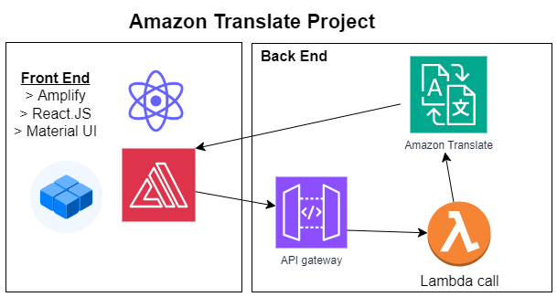

# AWS Translate project

This repository contains code to demonstrate how to use the AWS SDKs to translate text using Amazon Translate and convert it into lifelike speech using Amazon Polly. The example uses Python, but you can easily adapt it to your preferred programming language by using one of the many AWS SDKs.

Prerequisites
An AWS account with permissions to access Amazon Translate and Amazon Polly services. For more information about creating an IAM user with appropriate permissions, see the following:
[Amazon Translate Developer Guide - Managing Access Permissions](https://docs.aws.amazon.com/translate/)

## [Link to project Demo](https://main.d2dh5hcfwrkplf.amplifyapp.com/)

